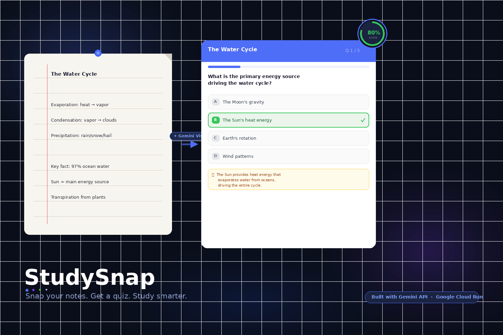
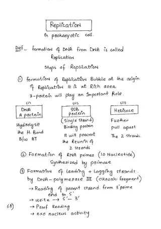
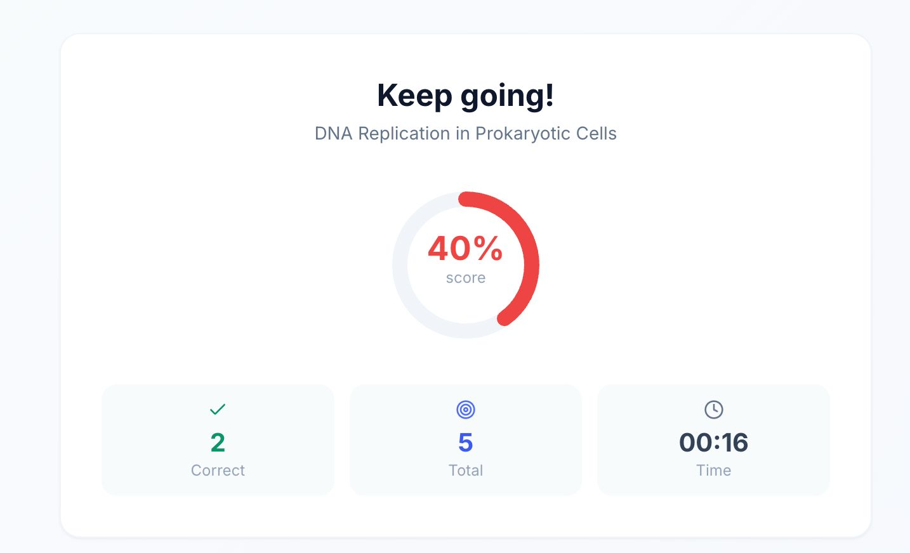
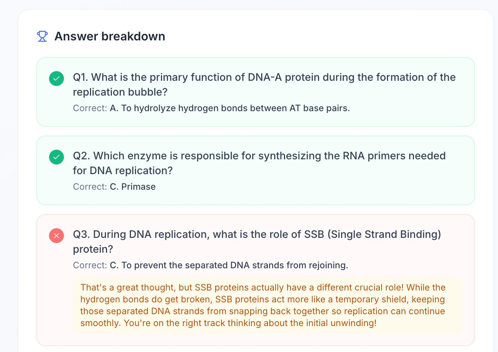
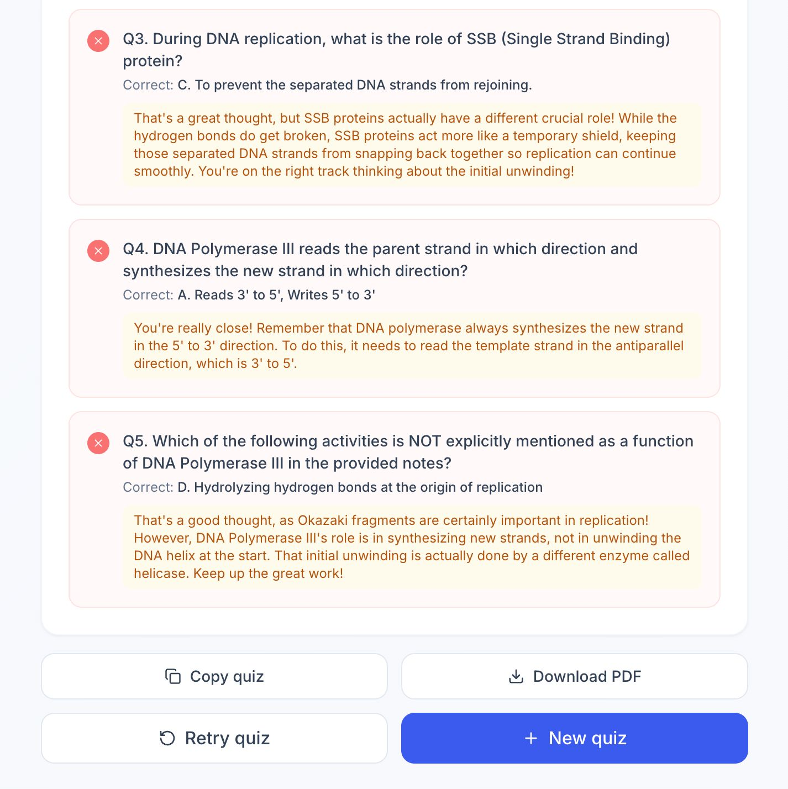

# StudySnap 📸

> Snap a photo of your notes. Get an instant quiz. Study smarter.

Built for the **Build with Gemini** hackathon. Uses **Gemini 2.5 Flash** vision to read handwritten or printed notes and generate interactive quizzes in seconds.


*Upload a photo of any notes and StudySnap instantly generates a ready-to-take quiz using Gemini Vision AI.*

---

## Features

- **Photo → Quiz** — Upload any image of notes, textbooks, or whiteboards
- **4 quiz modes** — Multiple choice, fill-in-the-blank, true/false, or mixed
- **3 difficulty levels** — Easy, Medium, Hard
- **AI explanations** — Wrong answers get a Gemini-powered explanation
- **Score summary** — Animated score ring, time taken, full answer breakdown
- **Export** — Copy as text or download as PDF

---

## Demo

### Input — Photo of handwritten notes


*A photo of handwritten biology notes on DNA replication in prokaryotic cells — exactly the kind of content StudySnap is built for.*

### Output — Generated quiz and results


*After completing the quiz, StudySnap shows an animated score ring, correct/total count, and time taken. The topic title is extracted directly from the notes by Gemini.*


*The answer breakdown lists every question with the correct answer highlighted. For wrong answers, Gemini generates a concise, encouraging explanation shown in the amber panel.*


*The full breakdown continues through all questions, each with its AI explanation. From here the student can copy the quiz as plain text, download a PDF, retry with the same questions, or start a new quiz.*

---

## Tech Stack

| Layer | Tech |
|-------|------|
| Frontend | React 18 + Vite + Tailwind CSS |
| Backend | Node.js + Express |
| AI | Gemini 2.5 Flash (Vision + Text) |
| Deploy | Google Cloud Run |
| PDF | html2pdf.js (client-side) |

---

## Quick Start

### 1. Get a Gemini API key
Go to [Google AI Studio](https://aistudio.google.com/app/apikey) and create a free API key.

### 2. Clone and install
```bash
git clone <your-repo-url>
cd studysnap
npm install           # root devDeps (concurrently)
cd server && npm install
cd ../client && npm install
cd ..
```

### 3. Set up environment
```bash
cp server/.env.example server/.env
# Edit server/.env and add your GEMINI_API_KEY
```

### 4. Run locally
```bash
npm run dev
# Frontend: http://localhost:5173
# Backend:  http://localhost:3001
```

---

## Deploy to Google Cloud Run

```bash
# 1. Build and push Docker image
gcloud builds submit --tag gcr.io/YOUR_PROJECT/studysnap

# 2. Deploy to Cloud Run
gcloud run deploy studysnap \
  --image gcr.io/YOUR_PROJECT/studysnap \
  --platform managed \
  --region us-central1 \
  --allow-unauthenticated \
  --set-env-vars GEMINI_API_KEY=your_key_here,NODE_ENV=production
```

---

## Project Structure

```
studysnap/
├── server/
│   ├── index.js          # Express API + Gemini integration
│   ├── .env.example      # Environment template
│   └── package.json
├── client/
│   ├── src/
│   │   ├── pages/
│   │   │   ├── UploadPage.jsx   # Upload + config
│   │   │   ├── QuizPage.jsx     # Interactive quiz
│   │   │   └── ResultsPage.jsx  # Score + export
│   │   ├── App.jsx              # Screen state machine
│   │   └── main.jsx
│   ├── index.html
│   └── package.json
├── imgs/                        # Demo screenshots
├── Dockerfile
└── README.md
```

## How Gemini is Used

1. **Image understanding** — `gemini-2.5-flash` reads the uploaded photo and extracts educational content using multimodal vision capabilities.
2. **Structured quiz generation** — A carefully crafted prompt instructs Gemini to return valid JSON with questions tailored to the chosen mode and difficulty.
3. **Adaptive explanations** — When a student answers incorrectly, a second Gemini call generates a personalized, encouraging explanation of the correct answer.

---

## Hackathon Submission Notes

- **Gemini API use**: Multimodal (vision + text generation), structured output, two distinct Gemini calls per session (quiz + explanations)
- **Prize targets**: Best Use of Gemini API + Best App Deployed on Google Cloud
- **Demo**: [Link to demo video]
- **GitHub**: [This repo]
